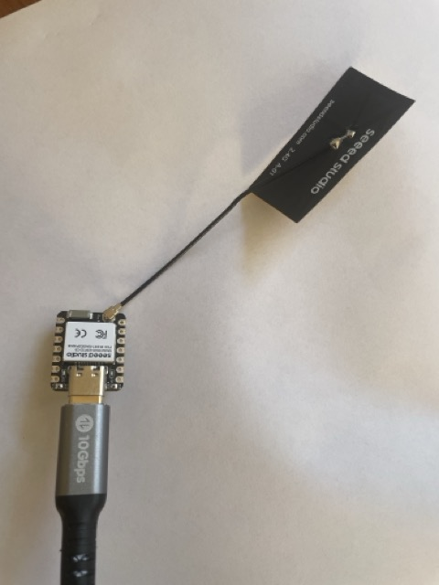

# Basic Example with XIAO ESP32-C6 and Espresif ESP32 Wifi Library

This is a basic example that does not need any sensors or actuators connected to your microcontroller.
It simulates a sensor value by incrementing a counter and stores the counter value in a Postgres database.

## Prerequisites

This example was tested with the following hardware and software:

### Hardware
- **XIAO ESP32C6 with exeternal anntena board**  
  https://wiki.seeedstudio.com/xiao_wifi_usage_esp32c6/

### Software
- Arduino IDE 2.3.6 or later
- Board Manager: XIAO ESP32C6 board - follow https://wiki.seeedstudio.com/xiao_esp32c6_getting_started/#add-board
- Library Manager:
  - [ArduinoJson by Benoit Blanchon v7.4.1](https://arduinojson.org/?utm_source=meta&utm_medium=library.properties)
  

