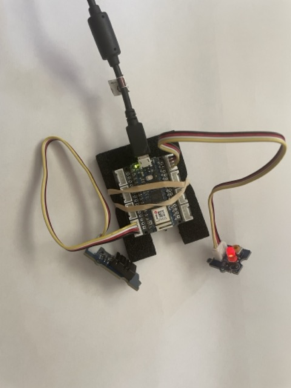

# Temperature, Humidity, and LED Example

This example demonstrates how to use a DHT20 temperature and humidity sensor (connected via I2C) and a Grove LED (connected to digital port D2) with an Arduino RP2040 Connect board. 

It shows how to store sensor data in a Postgres database and control an LED remotely via database commands.



## Features

### Sensor
- Reads real temperature and humidity values from the DHT20 sensor.
- Stores the sensor value history in a Postgres database.

### Actuator
- Retrieves the last LED state from the database and sets the LED accordingly.
- Allows remote control of the LED by updating the database.
- Confirms the applied LED state back to the database.

#### Remote LED Control via SQL

To control the LED from your Postgres database, execute the following SQL commands:

```sql
-- Switch the LED off
INSERT INTO actorvalues (actor_name, actor_value)
VALUES ('led', 'off');

-- Switch the LED on
INSERT INTO actorvalues (actor_name, actor_value)
VALUES ('led', 'on');
```

## Prerequisites

This example was tested with the following hardware and software:

### Hardware
- **Arduino RP2040 Connect board**  
  https://docs.arduino.cc/hardware/nano-rp2040-connect/
- **Grove shield for Arduino Nano** (with modification):  
  https://wiki.seeedstudio.com/Grove_Shield_for_Arduino_Nano/  
  [Forum discussion on compatibility](https://forum.seeedstudio.com/t/grove-shield-for-arduino-nano-v1-0-can-it-be-used-with-a-nano-rp2040/258699?u=bodobolero)
- **Grove Temperature and Humidity Sensor DHT20** (I2C port):  
  https://wiki.seeedstudio.com/Grove-Temperature-Humidity-Sensor-DH20/
- **Grove LED** (digital port D2):  
  https://wiki.seeedstudio.com/Grove-Red_LED/

### Software
- Arduino IDE 2.3.6 or later
- Board Manager: Arduino Mbed OS Nano boards → Arduino RP2040 Connect
- Library Manager:
  - [WifiNINA by Arduino v1.9.1](https://docs.arduino.cc/libraries/wifinina/)
  - [ArduinoJson by Benoit Blanchon v7.4.1](https://arduinojson.org/?utm_source=meta&utm_medium=library.properties)
  - [Grove Temperature and Humidity Sensor DHT20 by Seeed Studio v2.0.2](https://github.com/Seeed-Studio/Grove_Temperature_And_Humidity_Sensor)


